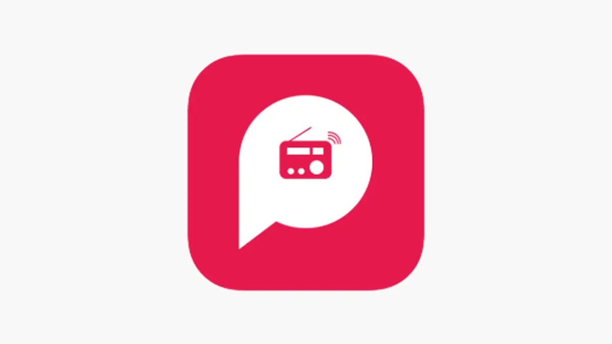

<p align="center">
  
  &nbsp;&nbsp;&nbsp;<strong style="font-size: 2em;">x</strong>&nbsp;&nbsp;&nbsp;
  
</p>

<h1 align="center">PocketFM x AppSmith</h1>

<p align="center">
  <strong>AppSmith CE, supercharged for PocketFM</strong><br>
  Enterprise SSO &bull; Granular Access Control &bull; RBAC for IAM &bull; Zero License Fees
</p>

<p align="center">
  
  
  
  
</p>

---

## &#x1F4A1; What Is This?

PocketFM's fork of [AppSmith Community Edition](https://github.com/appsmithorg/appsmith). We unlocked enterprise features &mdash; OIDC single sign-on, super admin restrictions, RBAC APIs for IAM &mdash; without an enterprise license.

Everything runs on our own infrastructure. Upstream CE is the foundation; our changes live on top.

---

## &#x26A1; Features We Added

| Feature | What It Does |
|:--------|:-------------|
| **OIDC SSO** | JumpCloud / generic OIDC login with auto-configured Spring Security registration |
| **OAuth2 Token Injection** | `{{APPSMITH_USER_OAUTH2_ACCESS_TOKEN}}` injects the logged-in user's token into datasource API calls |
| **Super Admin Restrictions** | Workspace creation, datasource editing, user invites, and role changes locked to super admins only |
| **Auto-Add Super Admins** | All super admin users automatically added as Administrators to every new workspace |
| **Workspace/App ID Vars** | `{{appsmith.workspaceId}}` and `{{appsmith.appId}}` available in datasource headers for backend routing |
| **RBAC for IAM** | AppSmith workspace membership and role management APIs serve as the RBAC source for PocketFM's IAM authorization |

---

## &#x1F527; What We Modified

| Area | What Changed |
|:-----|:-------------|
| **EE Feature Flags** | Force-enabled `license_gac_enabled`, `license_oidc_enabled`, `license_saml_enabled` in both client and server |
| **MongoDB Compatibility** | 15 EE enum stubs + fault-tolerant `AclPermission` converter &mdash; prevents CE crashes on EE-populated MongoDB |
| **Plugin Error Handling** | Null guards for EE-only plugins that have no JAR in CE &mdash; prevents NPE on home page |
| **Admin UI** | Hidden EE upgrade pages (Branding, Audit Logs, Provisioning); replaced Access Control with informational page |

---

## &#x1F680; CI/CD Pipeline

```
develop ──push──► Build Dev Image (:dev)
    |
    PR
    |
  main ──merge──► Build Prod Image (:latest)
```

| | Dev Image | Prod Image |
|:---|:---|:---|
| **Branch** | `develop` | `main` |
| **Trigger** | Push to `develop` | PR merge into `main` |
| **Tags** | `:dev`, `:dev-<sha>` | `:latest`, `:<sha>`, `:v<semver>` |
| **Client Build** | `REACT_APP_ENVIRONMENT=DEVELOPMENT` | `REACT_APP_ENVIRONMENT=PRODUCTION` |
| **Use Case** | QA / Staging | Production |

**Registry:** `ghcr.io/pocket-fm/appsmith-ce` (private)

Both workflows build **multi-arch images** (amd64 + arm64) with parallel jobs: server (Maven) + client (Yarn) + RTS, then Docker package.

---

## &#x1F33F; Branching Strategy

| Branch | Purpose | Protection |
|:-------|:--------|:-----------|
| `develop` | Development &mdash; all commits land here | None (direct push) |
| `main` | Production &mdash; PRs only from `develop` | Protected (require review) |

---

## &#x1F4E6; Deployment

| Environment | URL | Image Tag |
|:------------|:----|:----------|
| **QA** | `https://appsmith-qa.pocketfm.org` | `:dev` |
| **Prod** | `https://appsmith-prod.pocketfm.org` | `:latest` |

**Stack:** EKS (arm64 Graviton) &bull; Helm via ArgoCD &bull; AWS Secrets Manager via External Secrets Operator

---

## &#x1F4DA; AppSmith Resources

Appsmith is an open-source low-code platform for building internal applications &mdash; dashboards, admin panels, customer 360, and more.

&#x1F3AC; [Watch: Appsmith in 100 seconds](https://www.youtube.com/watch?v=jhyDI0e1o08)

| | |
|:---|:---|
| [](https://docs.appsmith.com/getting-started/setup/installation-guides/docker) | [Docker Install](https://docs.appsmith.com/getting-started/setup/installation-guides/docker) *(Recommended)* |
| [](https://docs.appsmith.com/getting-started/setup/installation-guides/kubernetes) | [Kubernetes Install](https://docs.appsmith.com/getting-started/setup/installation-guides/kubernetes) |
| [](https://docs.appsmith.com/getting-started/setup/installation-guides/aws-ami) | [AWS AMI Install](https://docs.appsmith.com/getting-started/setup/installation-guides/aws-ami) |

**More:** [Docs](https://docs.appsmith.com) &bull; [Tutorials](https://docs.appsmith.com/getting-started/tutorials) &bull; [Videos](https://www.youtube.com/appsmith) &bull; [Templates](https://www.appsmith.com/templates) &bull; [Local Dev Setup](https://github.com/appsmithorg/appsmith/blob/master/contributions/CodeContributionsGuidelines.md#-setup-for-local-development)

---

<p align="center">
  Built on <a href="https://github.com/appsmithorg/appsmith">AppSmith Community Edition</a> &bull; <a href="https://github.com/appsmithorg/appsmith/blob/release/LICENSE">Apache License 2.0</a>
</p>
